## Tasks
1. Project Description
1. Stakeholders
1. User Research Methods  
    i) Surveys and Questionnaires  
    ii) Scenarios  
    iii) Flow Analysis  
1. Reflections
1. User Task Descriptions
1. Appendix

---

### Project Description
This project is a mobile application to assist people with caretaking, growing, and managing potted plants that are grown inside homes. There are many reasons people own houseplants, ranging from air purification to house décor. However, owning these plants is not always as simple and easy as it is made out to be. Many houseplants can be tough to grow and keep alive due to a myriad of factors, such as temperature, humidity, and soil conditions. This can result in plants dying due to improper caretaking, and people being discouraged from purchasing and owning houseplants.

This is where the mobile application would come in. The app would provide users with many features that would help them tend to their plants, including an easily accessible and cohesive source of information for plants, reminders to take care of their plants, and guidelines on how to manage different species of plants. This mobile app would streamline all the aspects of houseplant ownership into one easy to use service, which would help current plant owners get a better idea of how to tend to their plants and remind them to do so. It may also convince prospective plant owners who were held back by their lack of experience and knowledge, to go out and purchase a few plants.

---

### Stakeholders
The following is a list of stakeholders with a short description of each.  
- Plant Owners are the primary users of our app and describe those who already own one or more houseplants. These users may or may not necessarily be experienced with plant care so they may use our app to make sure their plants get the proper care.  
- Prospective Plant Owners are users who don’t currently own any plants but are interested in purchasing one. They will be using the app to better familiarize themselves with plants and help them choose which plants they may want to care for.
- Plant enthusiasts are users who mainly seek knowledge about different kind of plants. They may use our app (as well as other resources) to aid in their research of houseplants.  
- Plant sellers are any companies or vendors who include houseplants in their list of products. With an easier way to care for plants, customers may be more willing to purchase their products. Therefore, they can benefit from a plant-care application.

---

### User Research Methods

#### I. Surveys and Questionnaires
The first IDEO card selected was Surveys and Questionnaires. This strategy was selected to gauge the experience levels of potential app users and their needs. We wanted to understand:  
- How comfortable users feel with plants without an aide,
- How current plant owners own and handle plants,
- Whether non-plant owners would like to own plants and if so, what stops them, and
- Common issues plant owners struggle with.

Towards this goal, we created a survey. At the beginning of the survey, participants were asked about their general comfort level with plants and whether they own plants. Depending on their response, they were then asked questions geared towards either plant owners or non-plant owners. Finally, all participants were asked about common issues with plant care and how they might interact with a plant care app. 

Of the 18 participants in the survey, about 60% owned plants while 40% did not. Comfort level with plants varied, but none of the participants felt fully confident in their ability to care for plants. In fact, most of the current plant owners avoid owning plants that require special care, and over half do not know what plants they own.

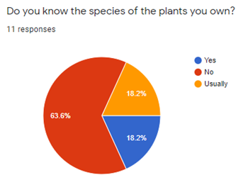

For non-plant owners, we were pleased to see that as we had hoped, most would be open to owning plants. The largest barrier to owning plants was fear of killing plants. This makes sense, as two thirds of all participants had killed a plant before, with about half of plant deaths occurring for unknown reasons. 

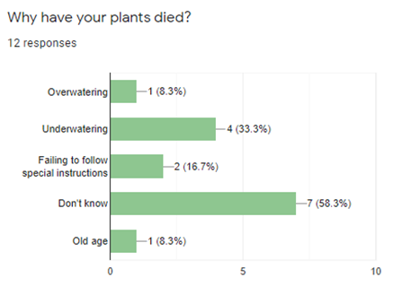

These reasons corresponded well with app features suggested by participants. The most requested features included guides for setup and care, and care reminders.

---

#### II. Scenarios
The next IDEO card that would help us further explore these features is scenarios. Thinking of several scenarios where the app might be used would help us identify the purpose of our app and in what situations might the app be used. Helping us build the features of the app in a way to make sure that all scenarios are achieved. Coming up with a few scenarios really helped us establish how and in what situations our app may be used. This gave us a road map to make sure that we tackle all these situations, so our app is used by all users in these scenarios and is successful in achieving the scenario.  
**1)** Grocery shopping in the superstore, I see some beautiful plants that would make my balcony look beautiful. Yet I am not sure what plants would be best for my schedule as I am not home all the time and sometimes have to travel for several days at a time. 

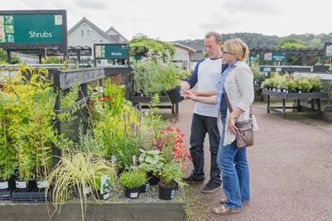

**2)** The app says my plant needs to be watered, but I know this type of plant needs to dry out between watering. When I checked, the plant was still a little damp. It might need to be watered tomorrow instead, but how will I get a reminder? 

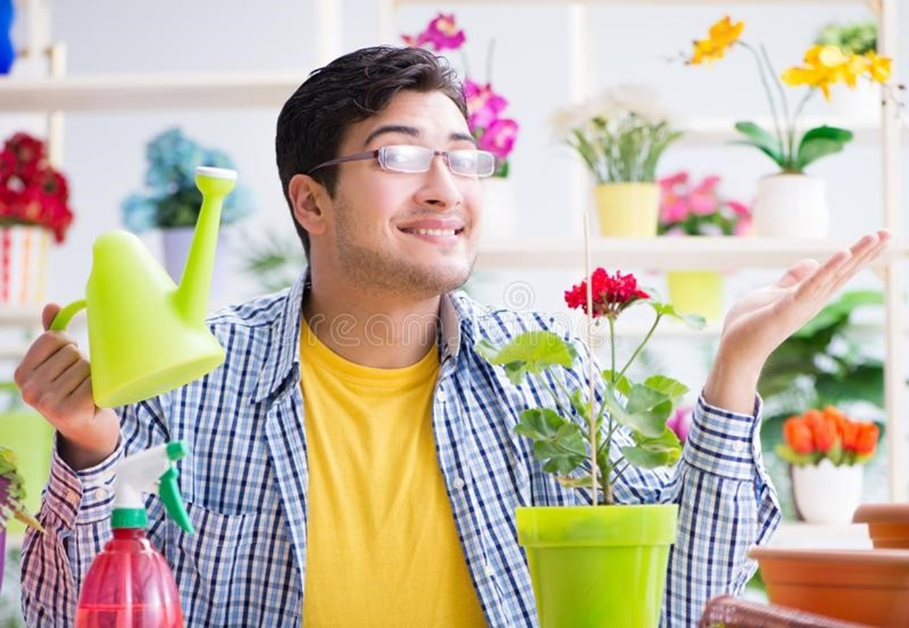

**3)** I love plants but have a black thumb. Every plant I have ever cared for ends up dried in less than a month! I wish there was an app that would tell me what I’m doing wrong.

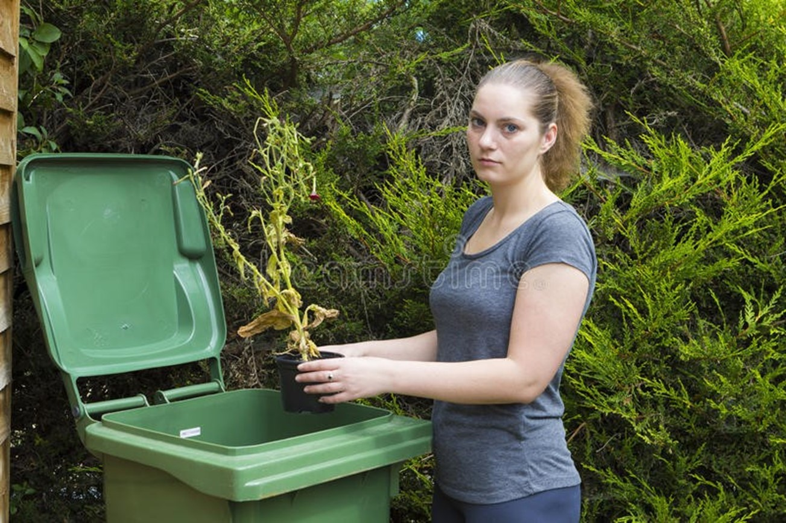

The remaining scenarios are listed in the appendix.

---

#### III. Flow Analysis
The final IDEO card that we decided to implement was flow analysis. From the information gathered using the survey and questionnaire and scenarios methods, we were able to imagine possible paths that users would take when using the application and represent it in a process flow. While creating the process flow, we were able to identify potential bottlenecks with the design we originally had in mind, as well as catch bits of information and data that may have been overlooked at first. However, the biggest benefit to this method was that creating a process flow from the information we gathered via the other two IDEO cards allowed us to gain further insight into when, where, and how people may use the app. This in turn enabled us to further streamline the application as we now had a better idea as to what features were essential, and what features were more trivial.

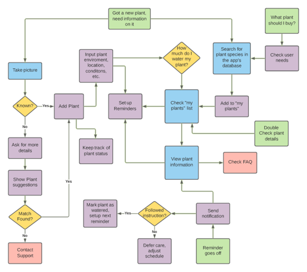

As seen in the flow chart presented above, many uses cases pass through the “My plants list” feature. This indicated to us that this was a feature would be a key focus of our app, as it could potentially cause a bottleneck if it were to be designed poorly.

---

### Reflections
The IDEO card research went quite well. Planning a timeframe helped us delegate time to each task and ensure we had enough time to gather survey responses to use in subsequent cards. Setting up the survey to show different sections depending on previous questions was also helpful, as participants seemed happier to give detailed responses. These responses also helped the team with scenario creation, which, in turn, was helpful for creating tasks. Finally, using flow analysis last was helpful, as it led the team to think about some odd cases to consider. Doing this analysis together in LucidChart also helped to spark thoughtful conversations. 

Given the limited timeframe and our limited experience levels, the team thought nothing went particularly poorly. But given the chance to do the process again, there were some areas we would improve. While it was easier to generate the tasks after conducting some research, having a few defined at the beginning would have given the team more opportunities to research interest and have a more structured approach to task prioritization. We would also try to send out our survey even earlier in the process to give ourselves as much time as possible to collect responses and better analyze results. 

---

### User Task Descriptions

**Must Be Included:**
1. Able to manually set reminders to water plant and/or for plant maintenance. Application will recommend the best settings for the reminders given the plant species, age, location, environment, sunlight, humidity, etc.
2. Access catalogue of plant care instructions for a large multitude of plant species.
3. Plant Identification, whether through visual input, and/or through input of descriptive traits of a given plant.

**Important:**
1. Create a list of plants that you’d be interested in adding to your collection.
2. Keep track of plant health and status through pictures and/or a journal, distinct to each unique plant in your care.

**Could Be Included:**
1. Receive a message if application determines that a plant has not received sufficient care.
2. Receive a plant recommendation between some time intervals (daily, weekly, monthly, etc.)

---

### Appendix

#### Survey Questions

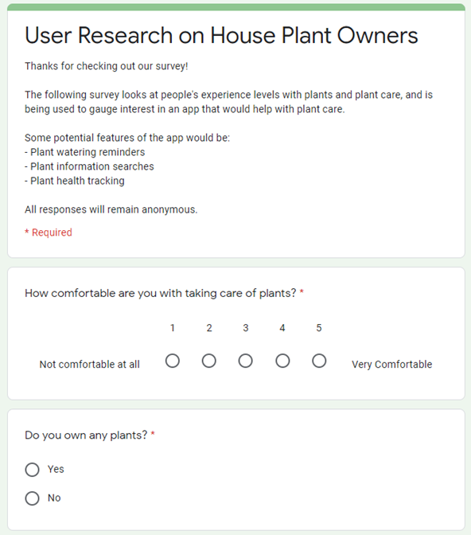

Questions for houseplant owners – only reached if the user answered yes to “Do you own any plants?”:

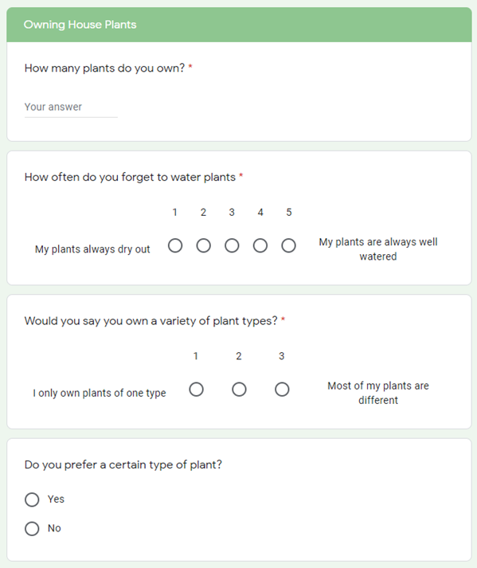

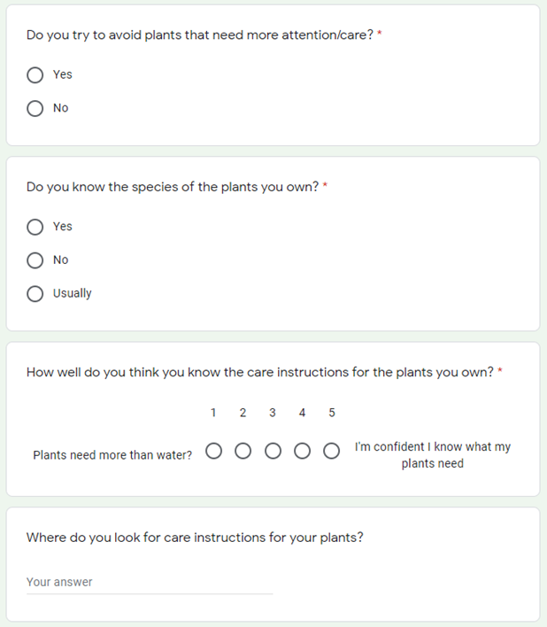

Questions for people without plants – only reached if the user answered no to “Do you own any plants?”:

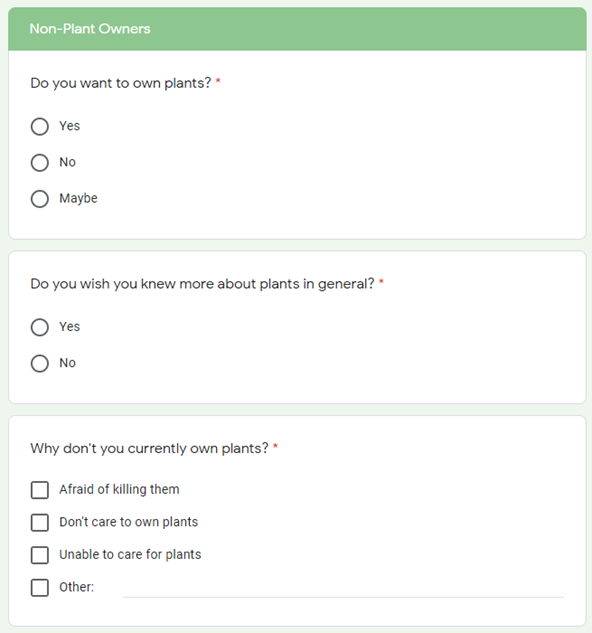

After answering questions relevant to owning/not owning plants, the survey converged again:

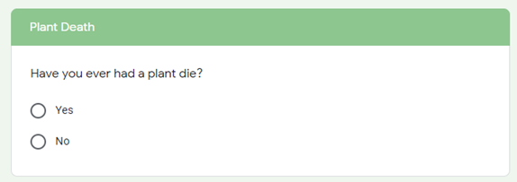

If the participant had killed a plant:

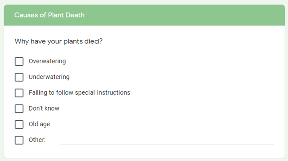

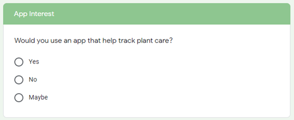

If the participant said yes or maybe to using a plant care app:

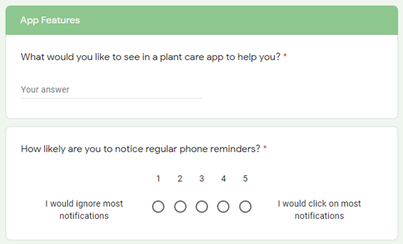

#### Survey Response Breakdowns from Google

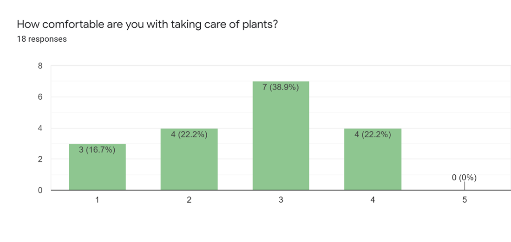  
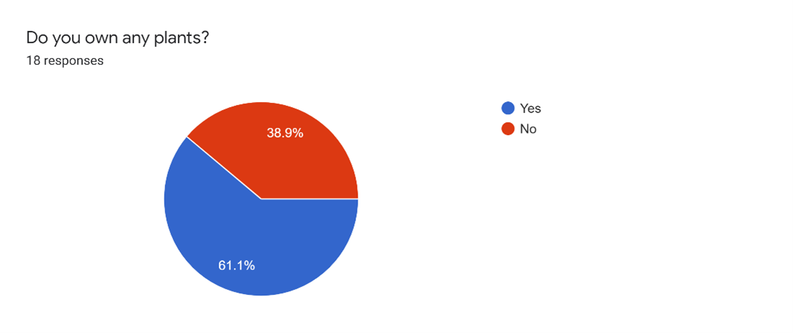  
  
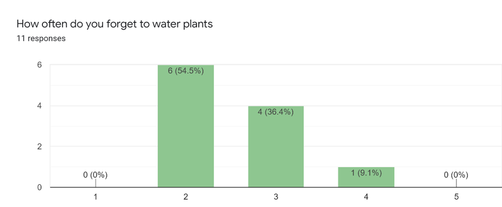  
1 = My plants always dry out, 5 = My plants are always well watered  
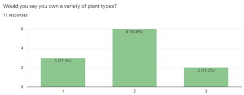  
1 = My plants are always well watered, 3 = Most of my plants are different  

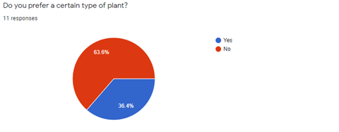  
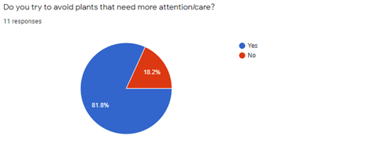  
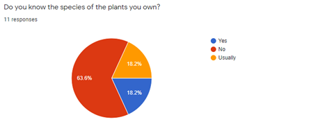  
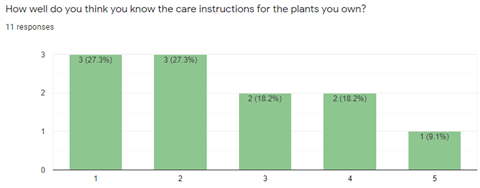  
1 = Plants need more than water?, 5 = I'm confident I know what my plants need

Where do you look for care instructions for your plants?
- YouTube (5)
- Google/Internet/Websites (6)
- Mom (1)
- The plant’s instruction booklet (1)
- The earth speaks to me and tells me my plants’ needs (1)
- Friend (1)

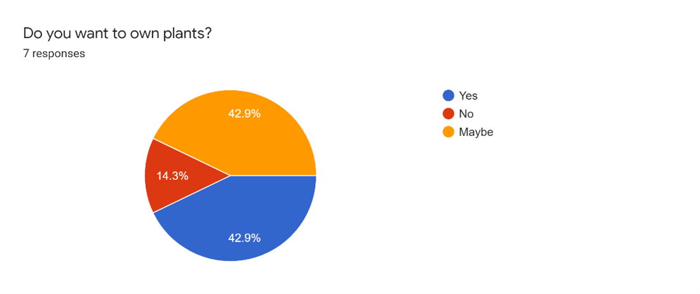  
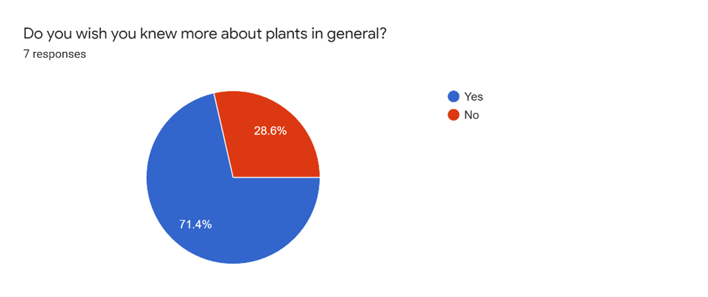  
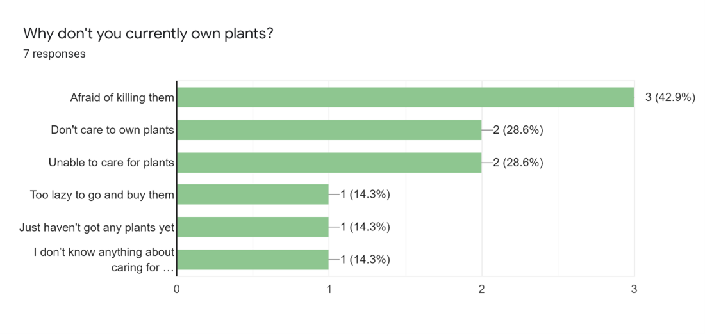  
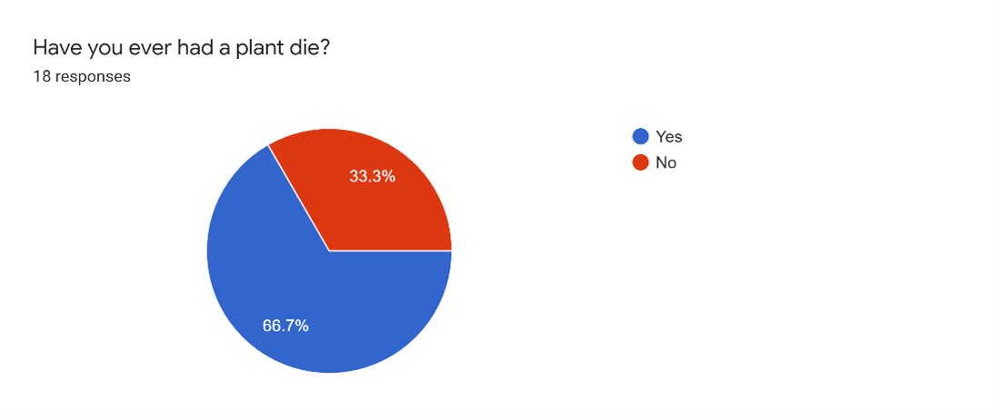  
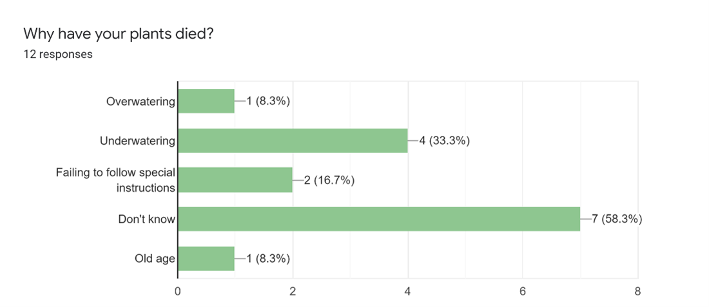  
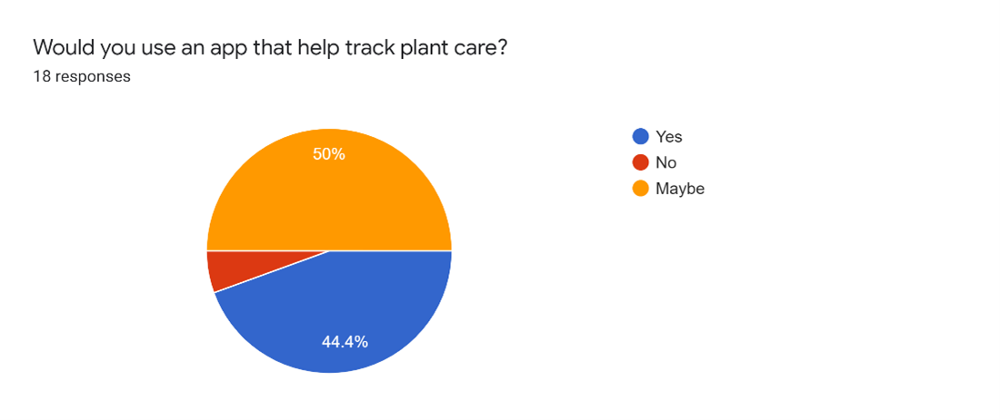  

What would you like to see in a plant care app to help you?
- What my plant needs for growth?
- Identification of plant
- Reminders, amount of water
- I'm not sure. Maybe something to tell me the health of a plant given it's species to tracking the soil saturation level/mineral content?
- What type of environment it lives in
- How much should I water a plant (with a set schedule for me to follow)
- just a small reminder for specific things that i will have to do to make sure my plant stays alive.
- reminders, instructions, diagnosis if possible
- Give me guidelines on how to care properly for a plant and recommend houseplants depending on where I live
- What I should do with my plant, also keep track of if I have water it or not
- Information for common houseplants, such as sunlight, water, soil needs
- Determine plant type and how to care for it. Keep track of taking care of plant.
- Clean interface, accurate and important details, non-intrusive reminders
- A rough description of it' status.
- Data tracking and a note section to keep track of any abnormalities
- Monitoring water levels; monitoring if the plant is getting enough sunlight; monitoring soil quality

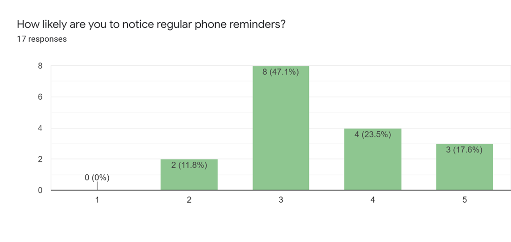  

#### Scenarios
1. I check on my plants every day to make sure they are doing okay by watering them given the recommended amount, keeping track of its soil, and maintaining everything properly. Yet, I see this weird lump or sometimes random ‘rashes’ and when I try to google them it just says they are dying but they seem to still be doing fine the next day or week or even month. But I would still like to know what’s happening to the plant.
2. I recently moved out on my own and wanted to get a few plants for my apartment, but I’m worried that I will do something wrong, or forget about something, and my plants won’t grow much, or at all. 
3. I got a plant from a friend for my birthday. It came with a cute pot and no instructions whatsoever. I want my friend to see it alive next time they come for a visit, so I need to figure out what it is, and how to take care of it. 
4. I’ve been taking care of plants for a long time, but now I have so many that it feels like I must go around and check them all every day. Since that takes a long time, I want to know which ones need attention. 
5. I’ve never owned plants before and now that I have plants, I’m not sure if the way my plant is growing/developing is supposed to be normal, or if something has gone wrong with my plant. 
6. My plant keeps growing at weird angles and now it looks kind of funny. How can I make it grow nice like the picture?

#### Links and Citations
- Survey
    - [https://docs.google.com/forms/d/1nAPdWbr21YYhBJktySjQbKu4ycAECOAuJBMxZn7PvY4/edit?usp=sharing](https://docs.google.com/forms/d/1nAPdWbr21YYhBJktySjQbKu4ycAECOAuJBMxZn7PvY4/edit?usp=sharing)
- Images
    - [https://www.dreamstime.com/gardener-florist-working-flower-shop-house-plants-image165436790](https://www.dreamstime.com/gardener-florist-working-flower-shop-house-plants-image165436790)
    - [Google Images](https://www.google.ca/imghp?hl=en&tab=ri&authuser=0&ogbl)
- Lucid Chart
    - [https://lucid.app/lucidchart/8b742d97-47c8-421e-bc19-ae333416c97a/edit?shared=true&page=0_0#?folder_id=home&browser=icon](https://lucid.app/lucidchart/8b742d97-47c8-421e-bc19-ae333416c97a/edit?shared=true&page=0_0#?folder_id=home&browser=icon)
