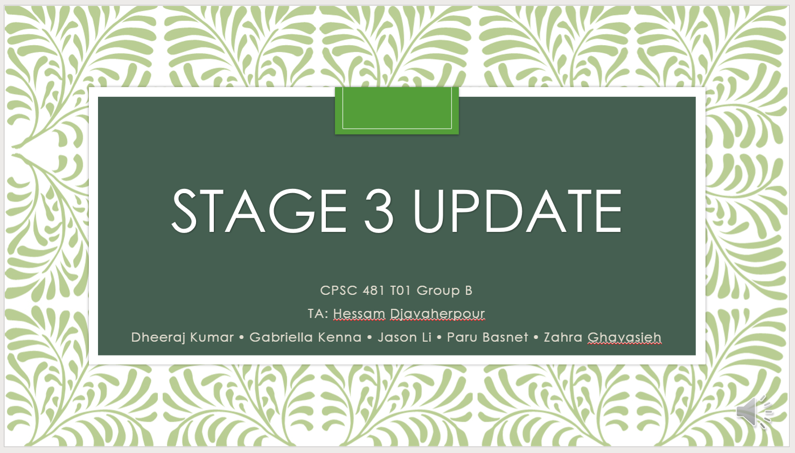

## Tasks
1. Brainstorm ideas and do 20 sketches
1. Affinity Diagram
1. Select and Polish ideas
1. Storyboard
1. Low-fidelity prototype
1. Task-centered system cognitive walkthrough
1. Prototype Demo
1. Stage 3 presentation

---

## Presentation
Follow this link to view the powerpoint presentation.

---

## Stage 3 Report

### Project Description
This project is a mobile application to assist people with caretaking, growing, and managing potted plants that are grown inside homes. There are many reasons people own houseplants, ranging from air purification to house décor. However, owning these plants is not always as simple and easy as it is made out to be. Many houseplants can be tough to grow and keep alive due to a myriad of factors, such as temperature, humidity, and soil conditions. This can result in plants dying due to improper caretaking, and people being discouraged from purchasing and owning houseplants.

This is where the mobile application would come in. The app would primarily display the user’s list of current plants on the Home Page, and upon pressing on an added plant item, a user may set reminders, view and add status updates, and view guidelines on how to manage their plant. It would also provide users with an easily accessible and cohesive source of information for each plant organized in the Plant Info page. Users may browse a catalogue of different plants or search for specific types of plants via the Catalogue. This mobile app would streamline all the aspects of houseplant ownership into one easy to use service, which would help current plant owners get a better idea of how to tend to their plants and remind them to do so. It may also convince prospective plant owners who were held back by their lack of experience and knowledge, to go out and purchase a few plants. 

---

### User Tasks
- Vertical Tasks: 
    1. Add a new plant using the camera. First, the user identifies the plant via camera, then they are shown a list of best matches based on the results. The user may then select a plant to add to their Plant List. If a match is not found, they have the option to try again or use a different method to identify the plant. 
    2. Add a new plant from the Catalogue. After browsing through the Catalogue, a user may select a plant to view its info or add the plant to their Plant List directly using the add button on the plant item. 
    3. Set up Reminders. When adding a new plant, the app will automatically calculate and set reminders based on the plant’s status. The user may turn on/off these notifications and edit or add extra reminders as necessary. 

- Horizontal Tasks: 
    1. View list of currently owned plants, more information about the plant, and its current status. 
    2. View a list of recommended plants in Catalogue that will be derived based on your preferences.  
    3. View plant information of currently owned plants as well as plants in the database/ Catalogue 
    4. Search for a specific plant in Catalogue. The search engine may feature an autocomplete function. 
    5. Add a new plant status to the journal to keep track of the plant’s health. 
    6. Add new plant to the Plant List by taking a survey to identify the plant species. 
    7. Use the camera to find information on a plant. 
    8. Edit a reminder that was previously set. 
    9. Navigate smoothly between different interfaces.

---

### Storyboard
How can we simplify the process of learning how to care for a new plant? 

---

### Discussion of Cognitive Evaluation
All tasks stated in our Stage 2 report were modified in one way or another in this stage. We either split those tasks into subtasks or elaborated on them further to make them more specific. These changes are as follows:

**Must Be Included Tasks:**
- The ability to set reminders remained the same. This is one of our vertical tasks for this stage. An extra horizontal task was added to describe the ability to edit a reminder. 
- The catalogue portion was divided into a vertical and three horizontal subtasks. These include the ability to add a plant, search for a plant, read information about a plant, and view recommended plants. 
- Plant identification was specified into identification via camera, as it collided with the task of adding plants.

**Important Tasks:**
- Creating a list of plants was subdivided into the tasks: adding a plant via camera, adding a plant via a survey, and view a list of current plants.
- Keeping track of plant health and status via a journal was not changed.

**Could be included Tasks:**
- Since these tasks involved receiving notifications, we did not include them in this report as they could not be prototyped with our abilities and knowledge.

After conducting the cognitive walkthrough of the first version of our low-fidelity prototype, we concluded that we should add optional guides for the less intuitive portions of our app, prioritize showcasing the major functions over the more minor tasks, and decrease ambiguity as much as possible through proper design. Afterwards, we modified the prototype based on some of the suggestions. For example, we added back navigation to allow users to backtrack to the previous screen or added information boxes for the plant identification survey questions. Some of the other suggestions were difficult to implement in a low-fidelity prototype so they should instead be implemented in the high-fidelity prototype or the product itself. These modifications include adding a user manual or guideline on how to navigate within the app and further explain some of the functions. 

---

### Reflection
As there was quite a bit to do in this stage, there were several points in the ideation process that stood out as going well or poorly. Something that really helped the process stay on track was setting up extra meeting times and setting goals for each meeting date at the beginning of the process. We also found that coming to brainstorming sessions prepared with some sketches helped group members to better articulate ideas and gave them some time to think about strengths and weaknesses of their ideas in advance. This also made the revisions process go relatively smoothly. The storyboard step also went relatively smoothly, aided by the tool Storyboard That which simplified the visual aspects of storyboard creation. Finally, for the lo-fi prototyping, splitting up the different parts of the app into a few standalone processes allowed the group to work on the prototype in parallel, which left the group more time to refine the final prototype at the end.  

One area that didn’t go as well was the affinity diagram. As we had to set our schedule before learning more in-depth about affinity diagrams, we needed to adjust for revisions that impacted later stages of the process. In general, the process felt rather rushed. If we were to do the process again, we would have allotted more time to work on the affinity diagram. We would have also taken some time to compile sketches for each task/area together into single documents. This would have made it a bit easier to compare the pros and cons of similar ideas during brainstorming sessions. 

---

### Links and Citations
- [Storyboard that](https://www.storyboardthat.com/) (used to create storyboard)
- [Balsamiq](https://balsamiq.com/) (used to create Low-fidelity prototype)
- [Affinity Diagram](https://lucid.app/invitations/accept/3cd5c01f-566b-4b3b-8397-10c54b50354b) made in [Lucid Chart](https://www.lucidchart.com/pages/landing?utm_source=google&utm_medium=cpc&utm_campaign=en_tier1_desktop_branded_x_exact&km_CPC_CampaignId=1490375427&km_CPC_AdGroupID=55688909257&km_CPC_Keyword=lucid%20chart&km_CPC_MatchType=e&km_CPC_ExtensionID=&km_CPC_Network=g&km_CPC_AdPosition=&km_CPC_Creative=442433236001&km_CPC_TargetID=kwd-55720648523&km_CPC_Country=9001331&km_CPC_Device=c&km_CPC_placement=&km_CPC_target=&mkwid=sVrXnwD0X_pcrid_442433236001_pkw_lucid%20chart_pmt_e_pdv_c_slid__pgrid_55688909257_ptaid_kwd-55720648523_&gclid=Cj0KCQiAy579BRCPARIsAB6QoIbWtBFYmcHLG1KyONwo2kiHybix1wI0vcCVvmLz0JFDW8Df9WfYp9caAoyGEALw_wcB)

---

### PDF
Read Full Report and Appendix on the [PDF document](https://github.com/judgyknowitall/cpsc481_teamproject/blob/master/stage3/Stage3Report_teamB.pdf).

---