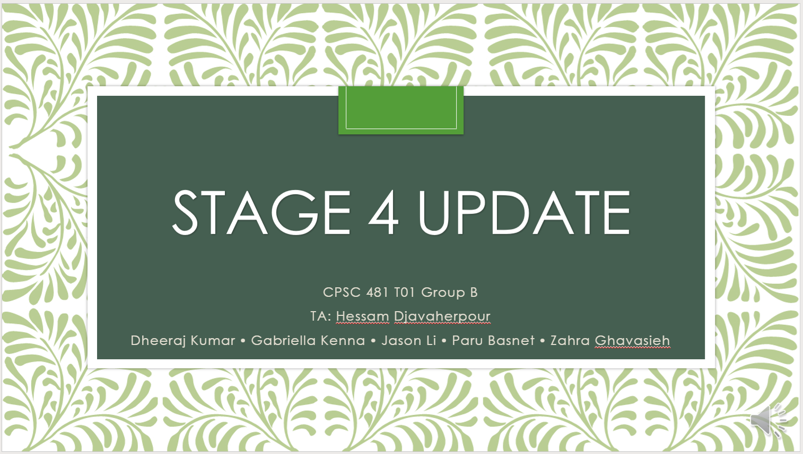

## Tasks
1. Hi-Fi prototype 4 major tasks
1. Conduct Heuristic Evaluation
1. Iterate Prototype
1. Prototype Demo
1. Stage 4 presentation

---

## Presentation
Follow this link to view the powerpoint presentation.

---

## Stage 4 Report

### Project Description
Our project application, **Pot Perfect** aims to help users of the application take better care of plants and to help users find and identify new plants that they might wish to learn more about or even add to their collection.  

Our application achieves the first goal of trying to assist in plant care through two main features. One of the features for assisting in plant care being customizable and guided reminders, which allows users to plan out a cycle for watering, maintenance, fertilizing, etc., that best fits their individual plants. The second feature for assisting in plant care is the plant journal which allows users to update the status of their plants over time, and therefore notice and log changes to their plants.  

Pot Perfect's second goal of helping users find and identify new plants is accomplished through two main features. The first feature is plant identification, which allows users to choose one of three methods to identify what a plant might be. The three methods being, scanning the plant with the camera, taking a plant-based survey, and lastly, looking up the plant directly through the search function in the plant catalogue. The plant catalogue also serves to accomplish the second feature, which is allowing users to learn more about plants that they are interested in. The catalogue accomplishes this through containing a database of plant species which gives users the ability to search for and then learn about plants by selecting them within the catalogue. These entries in the plant catalogue will hopefully contain everything a user might wish to learn about a given plant. 

---

### User Tasks

#### Vertical Tasks:  
Users can add a newly obtained plant to their plant list by using the camera to identify the type of plant.  
1. Click the menu button on the “Plant List” screen  
1. Click the plus icon which will take you to the “Add New Plant” screen  
1. Select the “Camera” option 
1. Point the camera at the plant and take a photo 
1. The app will provide a few plants based off what it determines to be the best matches 
1. The user selects the correct plant, and it will be added to their plant list 

Users can add a newly obtained plant to their plant list by using the catalogue provided.  
1. Click the menu button on the “Plant List” screen 
1. Click on the green book icon to open the catalogue 
1. Search for the plant species using the search feature in the catalogue 
1. Click the plus button corresponding to the correct plant, adding it to the plant list 

Users can set up reminders to attend to their plants.  
1. From the “Plant List” tap on the entry for the plant you want to set up reminders for 
1. On the “My Plant Info” screen, tap on the “Set Reminders” 
1. Tap on the pencil icon corresponding to the: 
    - Watering reminder to change the frequency of watering reminders 
    - Fertilizer reminder to change the frequency of fertilizing reminder 
    - Custom reminder to create a custom reminder with a name for the reminder as well as a date for when to be reminded. 

#### Horizontal Tasks:   
1. Users can view a list containing an entry for all the plants they currently own, which allows them to view more information about a specific plant, as well as the plant’s current health status.  
1. Additional information of currently owned plants can be viewed on the individual “My Plant Info” pages for each plant in “My Plant List”.  
1. Additional information of any plant in the database can be viewed on the individual “Plant Info” pages for all the plants.  
1. The catalogue can be searched in order to find the database entry for any plant in the catalogue.  
1. The journal for every plant the user owns can be updated with new updates in order to help keep track of a plant’s health.  
1. When adding a new plant to “My Plant List”, if users do not know what species their new plant belongs to, they can use the survey option to help identify their new plant and add it to their list.  
1. When adding a new plant to “My Plant List, the user can use the camera to take a photo of their new plant so that the application can help them identify the species of their new plant and add it to their plant list.  
1. Users can edit things about the reminders they have set up for their plants, such as the frequency of the reminders for watering and fertilizing a specific plant.  
1. Users can create custom reminders for any purpose, for any one of the plants in their plant list.  
1. The plant journal will show users when they have missed a reminder for one of the reminders that have been set up for one of their plants.

---

### Heuristic Evaluation
After designing the first draft of our high-fidelity prototype, our team was divided into three Evaluators and two Reviewers. Evaluators were given the Figma prototype in presentation mode and were then asked to interact with it independently while pretending to only know the general intent of the app. Each evaluator then wrote a list of problems they found in the app. The reviewers read each evaluation and individually constructed a table of issues ranked based on their severity and noted possible solutions. Finally, our team came together to read the final reviews and worked on creating the final draft of the prototype by addressing the more major problems first before trying to fix the minor ones. Since some of the issues couldn’t be addressed in the prototype, we decided to exclude them from the final heuristic evaluation report. All evaluations, the individual Reviews, and the final evaluation report are available in the Appendix.  

The issues were ranked 0 – 4 from negligible problems to usability catastrophes. Most rank 4 problems included major navigation problems such as being unable to escape certain pages or canceling tasks. Rank 3 Problems were major usability problems and they mostly included items that added confusion for the user such as insufficient or unintuitive icons. Some examples include wrong icons for depicting certain tasks or items that look like they can be tapped on but don’t have the functionality. Rank 2 issues are minor usability problems and include mostly items that could be clarified but are not overly important for the app to function, such as highlighting plants with overdue watering. Rank 1 problems include cosmetic problems and typos and finally rank 0 problems are negligible or cannot be fixed in the prototype. Some examples for rank 1 problems were unmatching colour palettes and difficulty to read certain text on top of similar coloured backgrounds. And some examples of the rank 0 problems were adding temporary information popups or adding extra information for all survey choices.  

By conduction this evaluation, our team was able to test our app and pinpoint its flaws. This was a very important process for us to be able to put ourselves in the users’ stead to see which aspects could be unintuitive and cause confusion. After the evaluation, we made major design changes to the Plant Reminders page and many other minor changes in places such as the Plant List and the Plant Info pages. By going through these changes, we were able to unify the colour palette of the entire application and refine its design.  

---

### Reflection
This stage went quite smoothly. As in previous stages, this success was aided greatly by a preset schedule of internal deadlines and regular meeting times. Using the cloud-based tool Figma to create our prototypes also helped by allowing the group to work in the same file concurrently and see changes happening as they were discussed. Prior to formal testing, frequent run throughs of the prototype helped us to find and fix most logical issues in advance. After testing and reviewing of test results, it was also very helpful having one larger meeting to go through these results, fix the issues found, and add final touches together, all while making sure nothing new broke.  

While many things went well, our unfamiliarity with Figma prior to the project caused some extra work. Because we were learning Figma’s functions, some time was lost to learning, as well as using some functions incorrectly or in a roundabout manner. If we were to do this again, we would spend some more time learning key features of the software prior to starting work on the prototype. We also ran into issues when a few pages’ goals were less well defined in the low-fi prototype. Doing this stage again, we would take some time to review the low-fi prototype as a group and add notes on any pages needing more details, to lighten the burden on the group member responsible for creating the initial hi-fi version of the page.  

---

### Appendix

#### Evaluation Documents

##### Dheeraj's Evaluation
- On the plant list front page, it says that the water symbol with 9 days underneath it. It is a little bit confusing, does it mean 9 days left or water every 9 days?   
- When on the plant Dia page there is no back button. To go back to home page.   
- The trash button does not work on all the plants I am not sure if that is supposed to work?  
- When pressing on Dia or Bach a picture of Vernoica or Dia pops up, (the previous plant) from my plant list I am not sure of understanding the purpose of that or if that is meant to be there.  
- Beside each plant name there is the ability to change the name, should there be at least 1 implementation of that?  
- When adding dieffenbachia to my plants, when we press the button it goes to veronica instead of Bach. The same thing occurs when adding Parodia, which should take you to the plant Dia. 
- Maybe in health status the name should be changed to veronica instead of aloe vera.  
- In sorting preference of settings maybe the one that is selected should be highlighted to make it clear of which one is picked currently.  

##### Gabby's Evaluation Doc
<u>Plant List</u>  
- A little tricky to see the plant/water images on the medium green  
- Names don’t particularly stand out  
- Plant list items with 0 days should maybe stand out somehow  
- A little tricky to see the buttons against the background, especially the + button  

<u>Settings</u>  
- Minor Typo -> “Comming Soon” should be “Coming Soon”  

<u>Catalogue</u>  
- Expected to be able to tap the entire row to view a plant  
- *…* button was confusing and hard to guess what it was for  
- Not clear that default items are recommendations  
- No prototyping for actual search – do we want this?  

<u>Add – Camera</u>  
- Feels very dark compared to other pages  

<u>Best Match</u>  
- Prototype back navigation breaks after getting to the best match screens  
- No good way to get back to the home screen if you don’t want to add the plant after all  

<u>Add – Survey</u>   
- No good way to escape once you’ve started  
- Don’t know button is a bit hard to see  
- Consistency -> should all the option buttons have an info button, even if they seem pretty straightforward?  
- Other Matches – horizontal scrolling is broken in the prototype  
- Should we just show top 3 next results?  

<u>Plant Info</u>  
- White text is a bit hard to read in the plant care section  
- No clear way to escape this page if you got here from the survey or catalogue and just want to go straight back to the plant list instead of adding    
- Got a little disoriented when scrolling down to the info didn’t fill the whole bottom of the screen. Seeing the little bit of the plant care felt a bit odd  

<u>My Plant Info</u>  
- Delete button doesn’t do anything – could maybe show a confirmation dialog?  
- Unclear what happens when the notification bell is on/off since there’s also Set Reminders below   
- White icons are hard to see on this background  
- If the plant bar could have a fixed position once it hits the top, that’d be super cool  
- I felt like I should be able to tap this like a button  

<u>Reminders</u>  
- The number of colours doesn’t quite feel like it fits with the rest of the app  
- The dates don’t’ really feel important enough to all be highlighted in red  
- The purple modal is inconsistent with other modals in the app  
- Not super clear what the difference is between the add reminder button and edit  
- Can’t cancel add/edit  
- Uncertain how I would set up auto-scheduled reminders or edit the days between auto-reminders  
- Add/Edit buttons will be too small to tap on a real device  
- Back button is hard to see  

<u>Journal</u>  
- Thought this whole thing was a button, was confused when I couldn’t click it all  
- Add button uses a different icon than other pages in the app  
- Colours get a bit overwhelming  
- Can’t cancel status update  
- Status updates area a little intimidating if you don’t really know what it means for your plant to be healthy – was expecting a few more details in the status update window  
    - Eg from sketches  

##### Jason's Evaluation Doc
- I felt as if there should have been an option for me to also add a plant via the catalogue, not just camera and survey  
    - What if I already know that plant I have?  
    - I shouldn’t have to go through a redundant plant identification process  
- Maybe the background should be darkened more when the menu button is pressed on the “Plant List”  
    - The “Add new plant” and button and to a lesser extent, the “catalogue” button are a little hard to see because of the background  
- Should the settings design better match the rest of the design?  
    - Also, I feel like the text for version of the app is too big  
    - Shouldn’t the languages in the language change be in their respective languages? (like Francais, Espanol)  
    - Is the gear on the settings screen centered?  
- I feel like the progress circle within the water droplet on the “My plant Info Page” makes it a bit too cluttered  
    - Number in the droplet enough?  
- The text for set reminders and health status on “My plant Info Page” is hard to see before scrolling down  
    - I’m noticing that this may just be an issue that varies from screen to screen because on one monitor it is clear, but on another, it is a bit difficult to read  
- Dia plant info page has no back button in top left  
- Went to camera to add plant -> clicked best match for more info -> went to plant info page -> clicked back button -> brought me back to My Plant List  
    - Should bring back to results of camera  
- I think the whole “Update Status Button” in journal should be clickable, not just the icon  
- No way to exit out of setting a reminder without submitting a new reminder  
- No way to exit out of submitting a new journal entry without submitting a new journal entry  

---

#### Review Findings

Through the testing done by Gabriella, Jason, and Dheeraj, the reviewers were able to find multiple severity 2, 3 and 4 problems. Many of the severe problems were found to be navigation related, such as the back function not returning the users to where it was supposed to, or certain navigations not registering in specific scenarios, and failing to consider different use cases. The reviewers determined less severe but common issues brought up in multiple testers evaluations. Some of these included a lack of a uniform theme for the application, typos, visibility issues and more. These persistent problems were placed a bigger focus for solving. Lastly, issues considered too superfluous and/or too costly to solve with too little of a return, were placed low in the severity rankings and either fixed with the least amount of priority or simply not fixed at all. 

##### Paru's Review
Review of Prototype Testing (Same problems will not be repeated)  

| Tester    | Problem                                                                                                                                                   | Severity/Priority   | Conclusion                                                                            |
|-----------|-----------------------------------------------------------------------------------------------------------------------------------------------------------|---------------------|---------------------------------------------------------------------------------------|
| Dheeraj   | Unclear information on watering cycles                                                                                                                    | Minor               | Could look to add text after “9 days” to make it clearer. E.g., “9 days remaining”    |
| Dheeraj   | No back button on plant page for “Dia”                                                                                                                    | Major               | Add back button                                                                       |
| Dheeraj   | Not all trash buttons are functional                                                                                                                      | Major               | Restore functionality to all trash buttons                                            |
| Dheeraj   | Inconsistency in navigation for plant page “Dia”                                                                                                          | Major               | Fix navigation on the page                                                            |
| Dheeraj   | Functionality to change name not implemented in prototype                                                                                                 | Minor               | Add functionality to prototype or remove functionality entirely.                      |
| Dheeraj   | Inconsistent navigation in “Add to My Plants” functionality                                                                                               | Major               | Fix navigation on the pages                                                           |
| Dheeraj   | Changing of name in health status to plants unique given name, instead of species name                                                                    | Minor               | Discussion required                                                                   |
| Dheeraj   | Lack of indication on which sorting method currently being used in settings                                                                               | Minor               | Implement indicator (Highlight, symbol, etc.)                                         |
| Gabby     | Images in plant list lack visibility                                                                                                                      | Minor               | Possibly change background color or implement borders around images                   |
| Gabby     | Names in plant list lack definition                                                                                                                       | Minor               | Possibly increase font size, change font color, or font styling                       |
| Gabby     | Plants that require immediate watering don’t stand out                                                                                                    | Minor               | Possibly change color of font to something more noticeable, such as red.              |
| Gabby     | Navigation menu buttons hard to see                                                                                                                       | Minor               | Possibly darken the layering when menu is selected                                    |
| Gabby     | Typo in settings. “Comming”                                                                                                                               | Minor               | Fix typo                                                                              |
| Gabby     | “...” button unclear in catalogue                                                                                                                         | Minor               | Possibly add text                                                                     |
| Gabby     | Recommendations not clear as recommendations in catalogue                                                                                                 | Minor/Major         | Differentiate recommendations somehow                                                 |
| Gabby     | No prototyping for search functionality                                                                                                                   | Minor               | Discuss                                                                               |
| Gabby     | Camera interface for scanning plants is very dark                                                                                                         | Minor               | Possibly change background to a lighter color                                         |
| Gabby     | Back navigation breaks after getting to best match screen                                                                                                 | Major               | Correct the navigation in the pages                                                   |
| Gabby     | Returning to home screen from match screen is unclear                                                                                                     | Minor/Major         | Possibly add back to home button                                                      |
| Gabby     | Hard to leave add-survey once started                                                                                                                     | Minor               | Possibly add back to home button                                                      |
| Gabby     | “Don’t Know” button is hard to see                                                                                                                        | Minor               | Possibly change color of button to something starker to the background                |
| Gabby     | Lack of information for the options in the add-survey screens                                                                                             | Minor               | Possibly add an information tag to options                                            |
| Gabby     | Other matches horizontal scrolling is broken                                                                                                              | Major               | Possibly only show the top 3 matches                                                  |
| Gabby     | White text on plant info is hard to read                                                                                                                  | Minor               | Possibly change text color or add border to text                                      |
| Gabby     | Navigation in plant info is unclear                                                                                                                       | Minor/Major         | Implement better/more intuitive navigation                                            |
| Gabby     | Page layout of plat info pages disorientating                                                                                                             | Minor/Major         | Unsure/Discuss                                                                        |
| Gabby     | Notification bell in My Plant Info is unclear about what it does as there is a Set Reminder option below it                                               | Minor/Major         | Possibly add an information tag to understand the functionalities better              |
| Gabby     | White icons in My Plant Info hard to discern                                                                                                              | Minor               | Possibly change icon color or add borders to icons                                    |
| Gabby     | My Plant Info interface gets cut while vertical scrolling                                                                                                 | Minor               | Possibly add limit to how high it can go up                                           |
| Gabby     | Water cycle display in My Plant Info looks as though it can be clicked                                                                                    | Minor               | Possibly make it clickable to see more information on the watering cycles             |
| Gabby     | Reminders color scheme looks different to rest of the app                                                                                                 | Minor               | Possibly change color scheme to make it more uniform with the app                     |
| Gabby     | Difference between add and edit button in reminders is unclear                                                                                            | Minor               | Unsure/Discuss                                                                        |
| Gabby     | Unable to cancel one adding/editing in reminders                                                                                                          | Minor               | Add a close functionality to the interface                                            |
| Gabby     | Unclear on setting up auto-reminders or edit days between auto-reminders                                                                                  | Minor/Major         | Possibly flesh out the reminders interface with more text and options                 |
| Gabby     | Add/Edit buttons on reminders too small for real world devices                                                                                            | Minor/Major         | Increase the size of the buttons and/or change button layout                          |
| Gabby     | Back button hard to see                                                                                                                                   | Minor               | Possibly change color or add border to icon                                           |
| Gabby     | Journals Update Status looks as though it should be clickable                                                                                             | Minor               | Possibly add such functionality                                                       |
| Gabby     | Add button in Journal uses different icon than other pages                                                                                                | Minor               | Change add icon to the ones used in other pages                                       |
| Gabby     | Colors of Journal overwhelming                                                                                                                            | Minor               | Possibly use same colors as in the other pages                                        |
| Gabby     | Can’t cancel status update in Journal                                                                                                                     | Major               | Add such functionality                                                                |
| Gabby     | Status updates somewhat overwhelming                                                                                                                      | Minor               | Possibly reduce amount of information in status update window                         |
| Jason     | Unable to add plant through catalogue, if say user already knows the plant species                                                                        | Major               | Add such functionality                                                                |
| Jason     | Design for Settings does not match rest of the app (Also font size looks too large)                                                                       | Minor               | Possibly change design scheme to match the rest of the application                    |
| Jason     | The different language options are not shown in their own language                                                                                        | Minor               | Show language options in their own language                                           |
| Jason     | Gear on Settings screen might not be centered                                                                                                             | Minor               | Determine and possibly fix positioning                                                |
| Jason     | Water droplet showing watering cycle in My Plant Info Page looks cluttered                                                                                | Minor               | Possibly remove the progress circle inside water droplet                              |
| Jason     | Navigation from Camera to plant info page, then clicking back button sends users to My Plant List rather than back to Best Matches from the camera scan   | Minor/Major         | Differentiate backing from Plant Info Page, if user arrived from Best Matches.        |

##### Zahra's Review
**(4) Usability Catastrophes** – Major navigation problems  
- No Back Button on plant Dia page   
    - Add Back Navigation  
- When clicking on a plant picture from My Plant List the page of the previous plant is displayed  
    - Fix Navigation  
- When adding a plant from Plant Info, the user is taken to a different My Plant Info page  
    - Fix Navigation  
- Back Navigation breaks after getting to Best Match Screens (Goes directly back to plant list)  
    - Fix Navigation  
- No good way to return to home screen if you don’t want to simply return to main menu from the Best Match Screen  
    - Add a close button on the top right side to discontinue adding plant  
- No escape from Survey once started  
    - Add a close button on the top right side to discontinue survey  
- Cannot cancel add/edit Reminder  
    - Add close or cancel button  
- Cannot cancel status update  
    - Add close or cancel button  

**(3) Major Usability Problems** – Aspects that create confusion  
- On the Plant List page, the plant items contain a number of days for watering. It is confusing if it means 9 days left or water every 9 days?  
    - Add a progress bar symbol to indicate that the plant needs watering in 9 days  
    - Use explicit language -> “9 days left”  
- Edit Plant Name Function not implemented  
    - Implement one instance or display a pop up that indicates this feature is not yet implemented  
- Trash Button does not seem to work  
    - Add a pop up to confirm deletion of plant from plant list   
        - indicate that it is not possible to remove plant in this prototype  
        - Or create instances of all combinations of the three plants in menu  
- In Catalogue, the “...” button is confusing. Expected that the entire pant item is clickable  
    - Remove button and make plant item clickable instead  
- No clear difference between Add and Edit Reminder buttons   
    - Either remove edit button or add a smaller edit icon for every reminder  
- Unclear how to set up auto-scheduled reminders or edit days between auto reminders  
    - Change design of the reminders page to distinguish between recurring reminders (automatically set at the beginning) and one-time reminders  
    - Or Simply only have Summer & Winter watering schedules, fertilizing schedules, and custom reminders   
- Add and Edit Reminder Buttons too small to tap on  
    - Change design of this page  
- Journal update Status looks like a button while only the icon is clickable  
    - Change colors and make text clickable too  
- Status update area a bit intimidating if unsure how to discern plant health  
    - Add more details  
    - Change design according to sketches  

**(2) Minor Usability Problems** – Reinforce item meanings and add clarity  
- In Health Status, the species of the plant is displayed rather than its nickname  
    - Change the name in Health Status  
- It is unclear which sorting preference is currently used in Settings  
    - Highlight the current selection  
- Plants with overdue watering should stand out  
    - Highlight the edges or colour the background with red   
- Cannot search items  
    - Add minor prototyping capabilities  
        - Not found page  
        - And an autocompleted Aloe Vera page  
- No clear way to escape Plant info page to directly go to main Menu  
    - Add close button on the top right corner  
- The Notification Bell on My Plant Info page is not very intuitive since there is also a Set Reminders Icon at the bottom  
    - Add a pop up when the notifications are turned off to remind user that they have turned off notifications and reminders will no longer notify their device  
- The Next Watering Section in My Plant Info seems clickable  
    - Add Navigation to Reminders page and add shadow for the button  
- Expected to be able to add plants by name in the add plant menu  
    - Change “Add Plant Menu” to “Identify plant Menu”  
    - Change icon  

**(1) Cosmetic Problems and Typos**  
- A little tricky to see plant/water images of Plant Items in Plant List  
    - Change Plant Item background colour  
- Plant Names don’t stand out in Plant List  
    - Bold Names  
- A little tricky to see the navigation buttons against the background in Plant List  
    - Whitewash the background instead of using grey  
- Typo in Settings: “Comming Soon”  
    - Change to “Coming Soon”  
- Camera Page looks very dark compared to the other parts  
    - Unify colour scheme with the other parts  
- “Don’t Know” button on the Survey is hard to see  
    - Apply a more button-like look to pop it out from the background design  
- White Text is a bit hard to read on light green backgrounds  
    - Change either the background or the text colour for clarity  
- The Plant Info page got a little disoriented when scrolling down to the info section  
    - Lengthen the info section so that it fills the entire bottom section  
    - Enable scrolling for the Title section  
- It would be cool to see the plant title bar fixed as well in My Plant Info  
    - Separate the frames and add Drag navigation to simulate scrolling  
    - Then, fix title bar  
- Reminders and Journal Page colours aren’t consistent with the rest of the app  
    - Change colour palette of this section  
- Back button is hard to see in the Reminders page  
    - Change colour scheme of the page  
- Add button in Journal uses different icon  
    - Change icon?  
- Colours in Journal can get overwhelming  
    - Change colour scheme  
- The Settings Design doesn’t match the rest of the app  
    - Change colour scheme and design  
    - Reduce text size to match the other sections  
- Titles for Setting screens need to be centered  
    - Add a title and an image icon for every screen  
    - Make sure they’re aligned (either to the left or center)  
- The progress circle in the water droplet for My Plant Info makes it a bit cluttered  
    - Make the droplet half full depending on how much water the plant has and remove both the progress bar and the number since they are displayed in the bottom half of the page  

**(0) Negligible Problems**  
- Catalogue -> it is not clear that default items are recommendations  
    - Add a text at the top  
    - Ignore this issue since from the users’ standpoint, they do not necessarily need to know if these plants are recommendations. The catalogue is meant to be similar to a store’s website where they can simply browse items.  
- Survey Choices don’t all have info buttons. This breaks consistency  
    - Not all choices need more information   
- Other Matches in Best Match Page do not have horizontal scrolling enabled  
    - Only showing the next top 3 matches should be fine.  
    - With a larger database, we could eventually add horizontal scrolling, but it is not needed for the current version.  
- Languages in settings should be displayed in their respective languages instead of English?  
    - Not necessarily. They could be changed depending on the language selected so it’s also clear which language is currently in use.

--- 

#### Final Heuristic Evaluation Report  
Severity Rankings:  
    **0 –** Problems that are either negligible or those not fixable in the prototype  
    **1 –** Cosmetic Problems and Typos  
    **2 –** Minor Usability Problems; mostly items that could be clarified  
    **3 –** Major Usability Problems; mostly items that add confusion  
    **4 –** Usability Catastrophes; mostly major navigation problems  

| Rank  |                                                                    Problem                                                                     |                                                                                         Solution                                                                                         |
|:-----:|:----------------------------------------------------------------------------------------------------------------------------------------------|:----------------------------------------------------------------------------------------------------------------------------------------------------------------------------------------|
|   4   | No Back button on plant Dia page                                                                                                               | Add Back Navigation                                                                                                                                                                      |
|   4   | When adding a plant from Plant Info, the user is taken to a different My Plant Info page                                                       | Fix Navigation                                                                                                                                                                           |
|   4   | Back Navigation breaks after getting to Best Match Screens (Goes directly back to plant list)                                                  | Create Overlays to fix back navigation                                                                                                                                                   |
|   4   | No good way to return to home screen if you don’t want to simply return to main menu from the Best Match Screen                                | Add a close button on the top right side to discontinue adding plant                                                                                                                     |
|   4   | No escape from Survey once started                                                                                                             | Add a close button on the top right side to discontinue survey                                                                                                                           |
|   4   | Cannot cancel add/edit Reminder                                                                                                                | Add close or cancel button                                                                                                                                                               |
|   4   | Cannot cancel status update                                                                                                                    | Add close or cancel button                                                                                                                                                               |
|   3   | On the Plant List page, the plant items contain a number of days for watering. It is confusing if it means 9 days left or water every 9 days?  | Add water icon for how many days left before watering and make this explicit in the Plant Info page                                                                                      |
|   3   | Trash Button does not seem to work                                                                                                             | Add a confirmation window and implement an instance                                                                                                                                      |
|   3   | In Catalogue, the “...” button is confusing. It is expected that the entire pant item is clickable                                             | Remove button and make plant item clickable instead                                                                                                                                      |
|   3   | No clear difference between Add and Edit Reminder buttons                                                                                      | Change design completely                                                                                                                                                                 |
|   3   | Unclear how to set up auto-scheduled reminders or edit days between auto reminders                                                             | Change design of the reminders page to distinguish between recurring reminders, which are automatically set at first and editable by user, and one-time custom reminders                 |
|   3   | Add and Edit Reminder Buttons too small to tap on                                                                                              | Change design completely and resize these buttons                                                                                                                                        |
|   3   | Journal update Status looks like a button while only the icon is clickable                                                                     | Make the entire item clickable                                                                                                                                                           |
|   3   | Cannot search items in Catalogue                                                                                                               | And an autocompleted search page                                                                                                                                                         |
|   2   | In Health Status, the species of the plant is displayed rather than its nickname                                                               | Change title to “Plant Journal” instead                                                                                                                                                  |
|   2   | It is unclear which sorting preference is currently used in Settings                                                                           | Outline the current selection                                                                                                                                                            |
|   2   | Plants with overdue watering should stand out                                                                                                  | Highlight the edges or colour the background with red                                                                                                                                    |
|   2   | No clear way to escape Plant info page to directly go to main Menu                                                                             | Add close button on the top right corner                                                                                                                                                 |
|   2   | The Next Watering Section in My Plant Info seems clickable                                                                                     | dd Navigation to Reminders page and add shadow for the button                                                                                                                            |
|   2   | Expected to be able to add plants by name in the add plant menu                                                                                | Add navigation to Catalogue from the Add Plant Menu                                                                                                                                      |
|   2   | When clicking on a plant picture from My Plant List the page of the previous plant is displayed                                                | Make Animation “Instant”                                                                                                                                                                 |
|   1   | A little tricky to see plant/water images of Plant Items in Plant List                                                                         | Change some of the colours, and resize the images                                                                                                                                        |
|   1   | Plant Names don’t stand out in Plant List                                                                                                      | Bold Names                                                                                                                                                                               |
|   1   | A little tricky to see the navigation buttons against the background in Plant List                                                             | Darken the background instead of using grey                                                                                                                                              |
|   1   | Typo in Settings: “Comming Soon”                                                                                                               | Change to “Coming Soon”                                                                                                                                                                  |
|   1   | Camera Page looks very dark compared to the other parts                                                                                        | Unify colour scheme with the other parts                                                                                                                                                 |
|   1   | “Don’t Know” button on the Survey is hard to see                                                                                               | Apply a more button-like look to pop it out from the background design                                                                                                                   |
|   1   | White Text is a bit hard to read on light green backgrounds                                                                                    | Change the text colour to dark green                                                                                                                                                     |
|   1   | The Plant Info page got a little disoriented when scrolling down to the info section                                                           | Enable scrolling for the Title section                                                                                                                                                   |
|   1   | Reminders and Journal Page colours aren’t consistent with the rest of the app                                                                  | Change colour palette of these sections                                                                                                                                                  |
|   1   | Back button is hard to see in the Reminders page                                                                                               | Change the colour scheme                                                                                                                                                                 |
|   1   | Add button in Journal uses different icon                                                                                                      | Change icon                                                                                                                                                                              |
|   1   | Colours in Journal can get overwhelming                                                                                                        | Change colour scheme                                                                                                                                                                     |
|   1   | The Settings Design doesn’t match the rest of the app                                                                                          | Change colour scheme and design                                                                                                                                                          |
|   1   | Titles for Setting screens need to be centered                                                                                                 | Add a title and an image icon for every screen, and make sure they’re centered                                                                                                           |
|   1   | The progress circle in the water droplet for My Plant Info makes it a bit cluttered                                                            | Make the droplet half full depending on how much water the plant has and remove both the progress bar and the number since they are displayed in the bottom half of the page             |
|   0   | Languages in settings should be displayed in their respective languages instead of English                                                     | This was implemented but was not necessary                                                                                                                                               |
|   0   | It is not clear that default items are recommendations in the catalogue                                                                        | This issue was ignored since it is not necessary for users to know                                                                                                                       |
|   0   | Some survey Choices don’t all have info buttons. This breaks consistency                                                                       | Not all choices need more information                                                                                                                                                    |
|   0   | Other Matches in Best Match Page do not have horizontal scrolling enabled                                                                      | Only showing the next top 3 matches should be fine                                                                                                                                       |
|   0   | Status update area a bit intimidating if unsure how to discern plant health                                                                    | Add autocomplete features (not available in prototype)                                                                                                                                   |
|   0   | The Notification Bell on My Plant Info page is not very intuitive since there is also a Set Reminders Icon at the bottom                       | Add a pop up when the notifications are turned off to remind user that they have turned off notifications and reminders will no longer notify their device (not available in prototype)  |
|   0   | It would be cool to see the plant title bar fixed as well in My Plant Info                                                                     | Too complicated to implement in the prototype                                                                                                                                            |

---

#### Links and Citations
- [Figma](https://www.figma.com/)
- [High-Fidelity Prototype](https://www.figma.com/proto/hIHzsICUnNFwG6mSxZjRJS/Hi-fi?node-id=1%3A3&scaling=scale-down)
- [Icons](https://thenounproject.com/)
- [Royalty Free Pictures](https://pixabay.com/)
- [Generate Markdown Tables](https://www.tablesgenerator.com/markdown_tables)