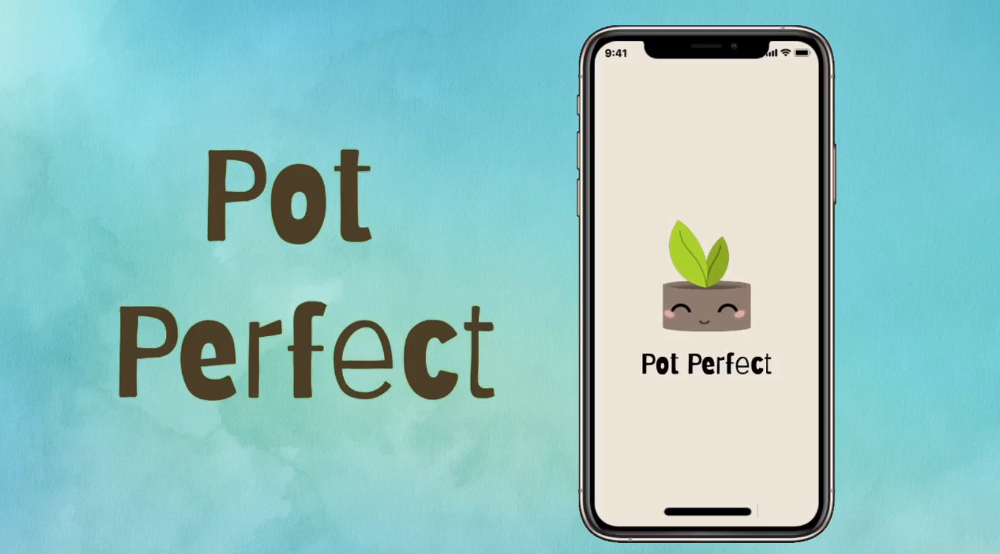
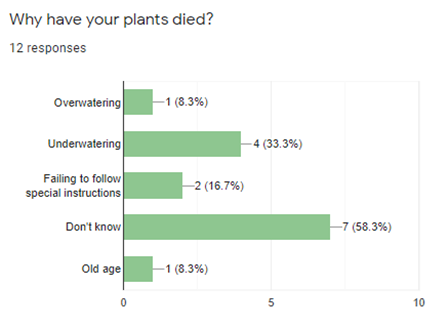
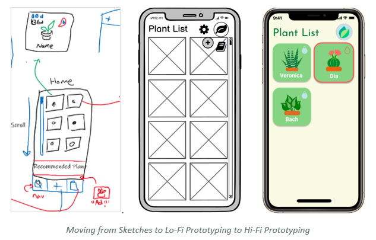
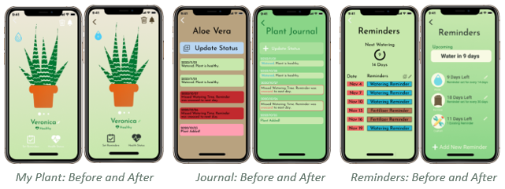

## Tasks
1. Refine Hi-fi
1. Prototype Demo
1. Final UCD Report

---

## Video Demo 
Follow this link to view our final High-fidelity Prototype Demo.

---

## Stage 4 Report

### Executive Summaru
Our project aims to develop an application that can be used by people of any experience level when it comes to plant information, identification, and care. Our mobile application, PotPerfect, seeks to accomplish these goals through a user-friendly interface that was developed and refined using HCI principles and techniques such as user research, design sketches, prototyping, cognitive walkthroughs, and heuristic evaluations. Our team first conducted a survey to try and understand what a user might want from our application and what our focus should be. With this information we developed sketches reviewed them one-by-one to identify key aspects, and added them to the low-fidelity prototype.  

 
With a low-fi prototype in place, we then conducted our cognitive walkthrough. We first created a lo-fi prototype with Balsamic, improved upon it with the data we received from our cognitive walkthrough, and then created a hi-fi prototype using Figma, which we refined with data gathered from our heuristic evaluations. These prototypes allowed our team to create interactive models where we could see whether HCI principles were properly translated into practice. Through this, we were able to develop an application that we believe to be presentable to a client. 

---

### Introduction
PotPerfect allows users to identify and better care for plants. Identification through functions, such taking a photo of the plant, taking a survey, and through browsing the plant catalogue, help users find the plant they need. PotPerfect also helps users with plant care through customizable reminders and plant journals that monitor each plant in the user's collection. An intuitive interface makes plant care accessible to all users, regardless of experience level. This follows our team’s goal by not only helping users who already own plants, but also to attract new plant owners by removing the reservations they had with plant care.  

#### Description of design problem and solution 
Originally, for the plant identification, we had chosen to have two options, which were plant scanning using the camera and an identification survey. The main issue we identified with this choice was if a user already knew the name of their new plant, it would be redundant to have them use one of the two existing options. The solution to this was to add a third option that would take the user to the catalogue where they would be able to use the search function to find the plant that they were looking for. Another issue we had with plant identification was how to properly communicate to the users that the plants the application identified using either the plant scan or survey were. The solution we chose was to implement a ranking system where the application would display the best match first, followed bellow by the less likely options. This increases the odds that the user finds the correct plant that they were searching for, since both plant scanning and survey are almost definitely never going to be completely accurate. For plant care, we chose to use a journal-based system for each unique plant in a user's collection as this would allow for in depth monitoring for each plant, and a customizable reminders system to notify users for things such as watering, fertilizing, etc. Since these designs were straight forward in their functions, our team did not encounter any problems to fix. 

#### End-users and Stakeholders 
The following is a list of stakeholders/end-users with a short description of each. 
- Plant Owners are the primary users of our app and describe those who already own one or more houseplants. These users may or may not necessarily be experienced with plant care so they may use our app to make sure their plants get the proper care. 
- Prospective Plant Owners are users who don’t currently own any plants but are interested in purchasing one. They will be using the app to better familiarize themselves with plants and help them choose which plants they may want to care for. 
- Plant enthusiasts are users who mainly seek knowledge about different kind of plants. They may use our app (as well as other resources) to aid in their research of houseplants. 
- Plant sellers are any companies or vendors who include houseplants in their list of products. With an easier way to care for plants, customers may be more willing to purchase their products. Therefore, they can benefit from a plant-care application. 

---

### User Research Methods and Process

#### Surveys and Questionnaires  
The first IDEO card that we selected was the _Surveys and Questionnaire_ card. We chose this strategy as it allowed us to gauge the experience and comfort level of potential app users and their needs. This strategy allowed us to better understand: 

- How comfortable users feel with plants without an aide 
- How current plant owners take care of their plants 
- Whether or non-plant owners would like to own plants and if so, what stops them 
- Common issues plant owners struggle with 

To achieve this, we created a survey. Of the 18 participants who took the survey, approximately 60% of them owned plants while the other 40% did not own plants. Comfort level with plants varied, but none of the participants felt that they were fully confident in their ability to care for plants. Even the participants who currently own plants actively avoid owning plants that require special care, and over half do not know what type of plants they own. For non-plant owners, it was clear that most would be more open to owning plants, but hesitant due to their lack of experience and knowledge, as well as the fear that they just end up killing the plants. This also correlates with the fact that two thirds of the participants had indicated that they have had a plant die in their care before. Half of the time, the plant deaths occurred for reasons unknown to the owner.  

#### Scenarios 
The second IDEO card that we used to further explore the features to include in our app was the _Scenarios_ IDEO card. For this strategy, we brainstormed several scenarios where the app might be used and used those cases to help us identify the purpose of our app and what situations our app would be used in. This helped us flesh out and add features to our app in a way that ensured all the scenarios were covered. Coming up with these scenarios allowed us to better establish how our app would be used and the situations in which our app would be used in, which then provided us with a clear roadmap for us to follow during further development.

#### Flow Analysis 
The final IDEO card that we implemented was the _Flow Analysis_ card. The information gathered from the survey and questionnaire and scenario methods allowed us to imagine possible paths that users would take when using the app and turn this information into a process flow. While creating process flow, identifying potential bottlenecks with our design became much easier. This process also revealed little bits of information and data that may have been overlooked at first. However, the biggest benefit to this strategy was the fact that the process flow enabled us to gain further insight into when, where, and how people may use the app. This is turn helped us further streamline the application as we now had a better idea as to what features were essential, and what features were more trivial.

---

### Important Design Choices and Justifications
Some important design choices that were made during this project was that optional guides should be included for the less intuitive portions of our app, prioritize the functionality and usability of the major functions rather than worry over the less important functions, and decrease the ambiguity of the UI as much as possible.
The decision to create optional guides for less intuitive functions was made to ensure that users would not end up being frustrated by a feature in our app that had no clear purpose and have nowhere to turn for help. Creating the guides also helped us streamline the functions and make them clearer and more useable for users. Prioritizing the functionality and usability of the major functions of applications was decided upon to ensure that the app would have a strong foundation to build off. If the functionalities that users were using 90% of the time were clunky or confusing, it could prevent many from even bothering with the more niche features. This decision also helped us further flesh out the app, as prioritizing the core functionalities helped create a solid base for other features to be added in. Finally, the decision to ensure that functions of the app were as unambiguous as possible helped the app deliver the best possible user experience, minimizing bottlenecks and frustrations that could occur during use.

---

### Lessons Learned During Prototyping

#### Low Fidelity Prototyping
The goal of lo-fi prototyping was to conceptualize designs and bring them to life. There were some concerns creating drawings since there were no connections or structure. One major concern was navigation. Lo-Fi design, although conveying minimum meaning, helped solidify how each page would lead to the next. The Lo-Fi also helped us to refine our mental image of the app, since it allowed us to see the dimensions of the phone and in turn helped us with positioning of the text, images, navigation bar and all the other features.  

#### High Fidelity Prototyping
Moving into the hi-fi prototype, we were left with couple problems when it came to fleshing out the design of the app. We encountered issues with color schemes and all the different outcomes that each button, modal, and screen could lead to. Moving from the black and white squares and filler text of the lo-fi, we had to consider things like color schemes, what pictures to use and to fill text boxes with meaningful text. These were all criteria which we had to research and learn about. We learned quite a lot about color schemes that would fit best on to our app and we choose to go with light colors and light gradients which gave our app soothing colors matching the feeling that plants give. After researching images, text and color schemes and putting together the vision of the Lo-Fi we noticed that there was much more to the app then just the Lo-Fi. Meaning that there were many different circumstances that the app could end up in. For example, if one were to add a journal entry before or after they enter a custom reminder, the prototype could reach an odd state. Through this issue we learned of all the different situations that the app can go through and designed the Hi-Fi accordingly.

---

### Heuristic Evaluation
After designing the first draft of our high-fidelity prototype, our team was divided into three Evaluators, and two Reviewers. Evaluators were given the Figma prototype in presentation mode and were then asked to interact with it independently while pretending to only know the general intent of the app. Each evaluator then compiled a list of problems they found. The reviewers read each evaluation and individually constructed a table of issues ranked based on their severity and noted possible solutions. Finally, our team came together to read the final reviews and worked on creating the final draft of the prototype by addressing the more major problems before trying to fix the minor ones. Since some of the issues could not be addressed in the prototype, so we decided to exclude them from the final heuristic evaluation report.
Issues were ranked 0 – 4 from negligible problems to usability catastrophes. Most rank 4 problems included major navigation problems such as being unable to escape pages or canceling tasks. Rank 3 Problems were major usability problems and they mostly included items that added confusion for the user such as insufficient or unintuitive icons. Rank 2 issues are minor usability problems and include items that could be clarified but are not overly important, such as highlighting plants with overdue watering. Rank 1 problems included cosmetic problems and typos. Finally rank 0 problems were negligible or could not be fixed in the prototype. Examples of rank 1 problems include unmatching colour palettes and difficulty to read text on top of similar coloured backgrounds. Some examples of the rank 0 problems were adding temporary information popups or adding extra information for all survey choices.
By conduction this evaluation, our team was able to test our app and pinpoint its flaws. This was a very important process for us to be able to put ourselves in the users’ stead to see which aspects could be unintuitive and cause confusion. After the evaluation, we made major design changes to the Plant Reminders page and many other minor changes in places such as the Plant List and the Plant Info pages. By going through these changes, we were able to unify the colour palette of the entire application and refine its design.

---

### Final and Future Changes
On the final Hi-Fi we have not any changes compared to the stage 4 as we incorporated all the tasks that were necessary and refined all the features in stage 4. In terms of future changes that could be inserted are more titles of the app which would help really make it a lasting impression for whoever that may use it. Maybe inserting a home button which could lead to the plant page, could be done by adding the navigation to every page and having a plant list button. Lastly, maybe fixing up some of the pages to be more consistent with a bubbly and circular design.

---

### Conclusion
This semester was a whirlwind, and although there were times when our team struggled to finish stage deliverables, we were able to pull through thanks to the members’ dedication and hard work. PotPerfect began with a simple idea which solidified through our User Research, flourished through our brainstorming sessions and sketches, and refined through our prototypes and evaluations. By choosing a simple idea, we were able to focus more on practicing the newly learned HCI principles and techniques. This in turn helped our team to not only apply the theory we were taught in class, but also create a beautiful application design which we would be interested to develop further in the future. Overall, this project was a great way to get an introduction to HCI and UI Design and we can’t wait to apply what we learned to our future projects.

---

### PDF
Read Full Report and Appendix on the [PDF document](https://github.com/judgyknowitall/cpsc481_teamproject/blob/master/stage4/stage4report_teamB.pdf).

---

(https://uofc.sharepoint.com/sites/GrpO365_Science_ComputerScience_CPSC481F2020-TeamB/Shared%20Documents/Team%20B/stage_5/PotPerfect_V3.mp4)
(https://github.com/judgyknowitall/cpsc481_teamproject/releases/download/v5.0/TeamB_Stage5_Report.pdf)